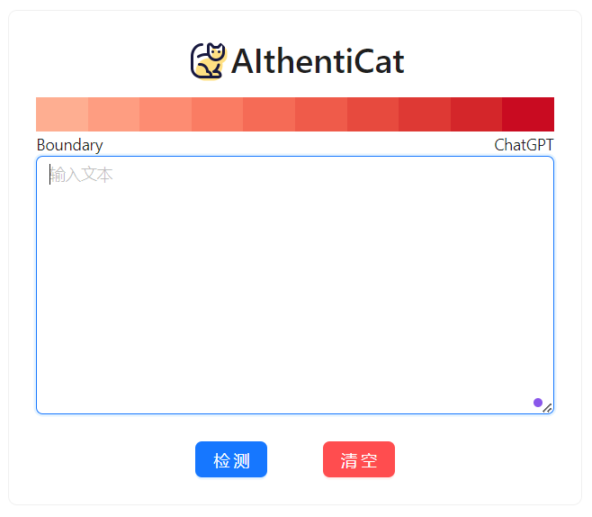

# AIthentiCat
a playful combination of "AI", "Authentic" and "Cat" as in catching fakes


## 后端

### 配置环境

需要python版本3.10

> 注：建议先安装好CUDA并且在GPU显存大于4GB的机器上运行后端来获得更快的运行速度。

```cmd
cd backend
pip install -r requirements.txt
```

### 运行

第一个终端窗口

```cmd
cd backend
python api1.py
```

第二个终端窗口

```cmd
cd backend
python api2.py
```

### API

打开 http://127.0.0.1:6001/docs 以及 http://127.0.0.1:6002/docs 可以看到自动生成的API文档

#### 使用样例(并不局限于下面的使用方法，只需要往相应的URL发送POST请求即可)

```javascript
fetch('http://127.0.0.1:6001/v1/predict_zh/', {
  method: 'POST',
  headers: {
    'accept': 'application/json',
    'Content-Type': 'application/json'
  },
  body: JSON.stringify({
    "data": "这句话有多大可能是ChatGPT生成的？"
  })
})
.then(response => response.json())
.then(data => console.log(data))
.catch(error => console.error(error));
```

输出：

```javascript
{
  "GLTR_prob": 0.5345993670734212,
  "PPL_prob": 0.42452311927798436
}
```

解释：

GLTR模型认为有53%的可能性是ChatGPT生成的。

PPL模型认为有42%的可能性是ChatGPT生成的，也就是说它认为这句话是人类创作的。

```javascript
fetch('http://127.0.0.1:6002/v2/predict_zh/', {
  method: 'POST',
  headers: {
    'accept': 'application/json',
    'Content-Type': 'application/json'
  },
  body: JSON.stringify({
    "data": "这句话有多大可能是ChatGPT生成的？"
  })
})
.then(response => response.json())
.then(data => console.log(data))
.catch(error => console.error(error));
```

输出：

```javascript
{
  "PTM_prob": 0.03212100267410278
}
```

解释：

PTM模型认为有3%的可能性是ChatGPT生成的，也就是说它认为这句话是人类创作的。


## 前端

### 准备环境

```cmd
cd frontend
npm install
```

> 注：如果 npm install 报错“400 Bad Request”，可以尝试[这个教程](https://blog.csdn.net/m0_54890506/article/details/135257913)

### 运行

```cmd
cd frontend
npm start
```

然后打开 http://localhost:6003/

你将能看到这样的界面：



